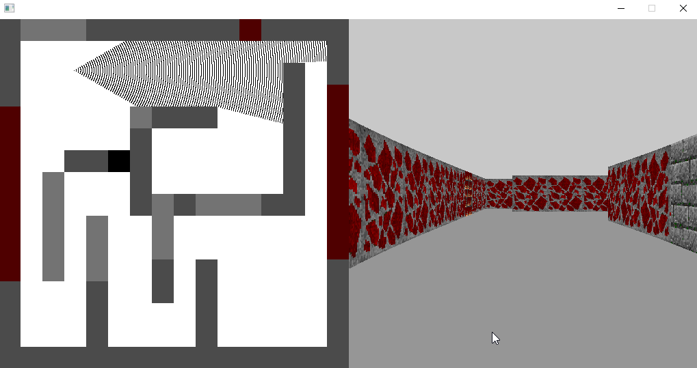

# tiny-ray-caster

A tiny ray caster using raw SDL2, written in F#

This is an F# version of the excellent tutorial **[here](https://github.com/ssloy/tinyraycaster)** by [Dmitry V. Sokolov](https://github.com/ssloy).

Why? Because I wanted to have a go using raw SDL2 from F# (not even using the SDL2-CS bindings from [flibitijibibo](https://github.com/flibitijibibo/SDL2-CS)).

Also, given that Dmitry's work is just 486 lines of C++, I was interested to see how a language almost on the other end of the high/low spectrum from C++ would do :)

## Running and Building

This has been coded in .NET Core 2.2, using VS Community 2017 on Windows 10. You can run it either using VS, or via `dotnet run` on the command line.

I have not tested it on other platforms - the only likely point of incompatibility would be the SDL2 library: included is the SDL2.dll from 2.0.9 for 64 bit windows. 

Alternative versions of SDL can be acquired from **[here](https://www.libsdl.org/download-2.0.php)**

## Learnings

Things I learned building this include:

- the netbpm format (https://en.wikipedia.org/wiki/Netpbm_format)
  - to open/view ppm files, I had to install **[gimp](https://www.gimp.org/)** on windows.
  - on linux/osx, it might be easier to install & use **display** in the terminal
  - ppm is an uncompressed image format, so is not generally recommended for images (which is probably why the support is so poor, plus its almost 40 years old)
  - Note: when I move to SDL, I removed the ppm code. Its in the history around [this commit](https://github.com/ChrisPritchard/tiny-ray-caster/blob/3edaf4ae00c5643363a00b4ed7ca1d6f5f526226/Program.fs#L76) if you want to see it.
- basic raycasting for wolfenstein 3D-esque rendering
  - the 'fish-eye' issue when rendering is something I learned more about (specifically how to solve it) from **[The Black Book](http://fabiensanglard.net/gebbwolf3d/)** by Fabien Sanglard. I recommend it.
- SDL2 Interop and Interop and general
  - My implementation is a combination of replicating what Dmitry did, with a conversion of the interop declarations by Flibit
  - I restricted to just what I need, so the SDL interop module is quite small. Where appropriate, I would declare flag-like constants as their raw value, generally derived by running SDL2-CS as a console app to get the value and then putting it here (e.g. SDL_PIXELFORMAT_ABGR8888 as 376840196u)
  - Event polling was complicated, and I ended up restricting to just the event I needed. The union hack in the SDL2-CS lib I couldn't get working with F# (ironic, since F# actually has unions)
  - Other reasons for not using SDL2-CS (i.e. other than the educational challenge) is that I only need a small subset of SDL2's signature, and SDL2-CS is not net standard (its Net Framework 4, as opposed to this project which is Net Core 2.2).

## Improvements

Things that could be done to improve this are:

- I didn't include the monsters from Dmitry's demo - I was more interested in ray casting and SDL interop, to be honest. Maybe something to do in future.
- Performance - while almost playable on my God-like gaming PC, its certainly far, far, FAR removed from the smoothness of, say, Wolfenstein 3D.